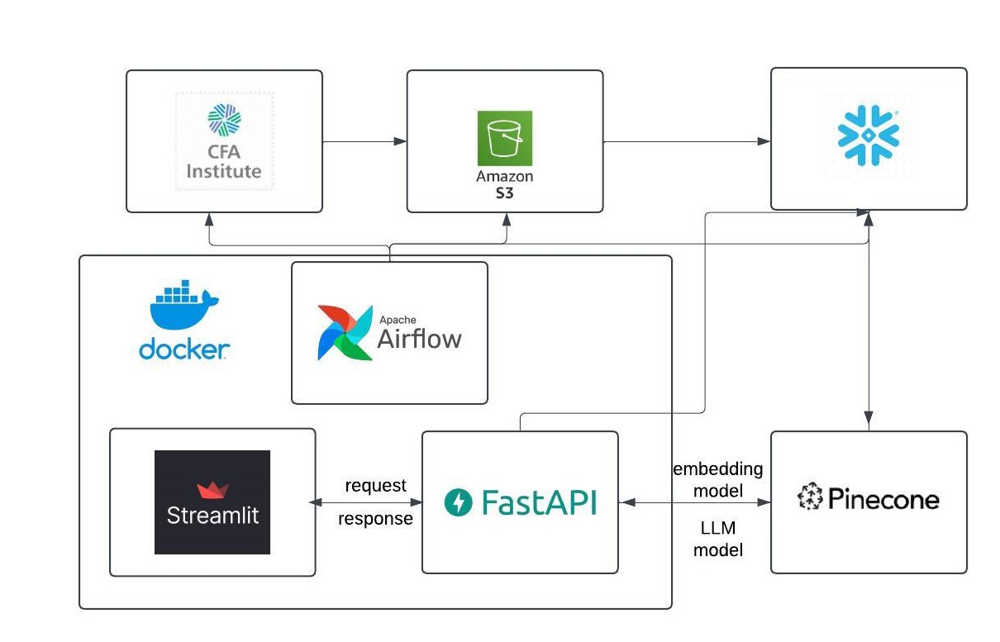

# Automated Pipeline for Cloud-Based Financial Research Retrieval and Interactive Exploration with Multi-modal RAG

## Overview

This project automates the ingestion, processing, and retrieval of financial research publications from the CFA Institute Research Foundation, providing users with interactive document exploration and question-answering capabilities using a multi-modal Retrieval-Augmented Generation (RAG) model. It integrates cloud technologies for data storage and indexing, a client-facing application for exploration, and a robust search capability through Pinecone as the vector database.

## Attestation and Contribution Declaration

WE ATTEST THAT WE HAVEN'T USED ANY OTHER STUDENTS' WORK IN OUR ASSIGNMENT AND ABIDE BY THE POLICIES LISTED IN THE STUDENT HANDBOOK.

**Contribution Breakdown**:
- Chiu Meng Che: 34%
- Shraddha Bhandarkar: 33%
- Kefan Zhang: 33%

## Workflow Diagram



The workflow diagram outlines the integration of major components including Apache Airflow, Streamlit, FastAPI, Amazon S3, Docker, and Pinecone. Documents are initially retrieved from the CFA Institute and stored in Amazon S3. Apache Airflow orchestrates the automated retrieval and processing pipeline. FastAPI serves as the middleware to facilitate the interaction between the Streamlit interface and backend services such as document processing, embedding models, and Pinecone for indexing. Docker is utilized to containerize each module to ensure a consistent and reliable deployment.

## Key Features

### **Automated Document Processing and Storage**
- **Data Scraping**: Apache Airflow automates the extraction of document data from the CFA Institute, including metadata, PDF files, and summaries.
- **Cloud Storage**: Extracted documents are uploaded and stored in Amazon S3 for secure and scalable storage.

### **Backend API with FastAPI**
- **Document Exploration**: Provides REST API endpoints to explore documents and their content, including metadata, summaries, and links.
- **Q/A Interface**: Allows users to interact with documents by posing queries, which are processed using AI models to extract insightful answers.
- **Embedding with Pinecone**: Utilizes Pinecone for storing document embeddings, enabling fast and efficient similarity searches.

### **User Interface with Streamlit**
- **Document Interaction**: A clean, intuitive UI for users to register, upload, and interact with documents. Users can query documents, explore extracted data, and generate custom research notes.
- **Authentication**: Provides secure user login and registration managed via an integrated PostgreSQL database.

### **AI-Powered Insights**
- **Multi-modal RAG Integration**: Supports Retrieval-Augmented Generation (RAG) for in-depth content analysis and dynamic answers to research questions.
- **Document Summarization**: NVIDIA-powered AI models generate concise and informative summaries to help users quickly understand document content.

### **Containerized Deployment**
- **Docker Compose Setup**: The entire project is containerized using Docker Compose, which ensures that all services (frontend, backend, pipeline) work seamlessly together and are easy to deploy.
- **Scalable Architecture**: Containerization allows for easy scaling and cloud deployment, providing reliability and flexibility.

## Project Structure

```bash
│  .env
│  .gitignore
│  project_tree_structure
│  
├── airflow
│   │  airflow.cfg
│   │  poetry.lock
│   │  pyproject.toml
│   └── dags
│       ├── pipeline.py
│       └── modules
│           ├── cfa_scrape_data.py
│           └── __init__.py
├── backend
│   │  delete_vector.py
│   │  document_processors.py
│   │  insert_vector.py
│   │  main.py
│   │  poetry.lock
│   └── pyproject.toml
├── frontend
│   │  poetry.lock
│   │  pyproject.toml
│   │  streamlit_app.py
└── images
        workflow_diagram.jpeg
```

## Prerequisites

**Docker**: Required to containerize and run the application services.
- [Download and Install Docker](https://www.docker.com/get-started)
- Verify installation:
  ```bash
  docker --version
  ```

**Docker Compose**: To manage the multi-container setup.
- Verify installation:
  ```bash
  docker-compose --version
  ```

**Poetry**: A Python dependency management tool.
- Install Poetry by following the instructions: [Poetry Installation Guide](https://python-poetry.org/docs/#installation)
- Verify installation:
  ```bash
  poetry --version
  ```

**Python 3.9+**: The project requires Python 3.9 or above.
- Verify installation:
  ```bash
  python3 --version
  ```

Ensure all prerequisites are installed before proceeding to deployment.

## Installation and Setup

1. **Clone the Repository**
   ```bash
   git clone https://github.com/your_repository/ai-driven-document-system.git
   cd ai-driven-document-system
   ```

2. **Environment Setup**
   - Use Poetry to install all dependencies:
     ```bash
     poetry install
     ```

3. **Running the Application with Docker Compose**
   - Start the entire system:
     ```bash
     docker-compose up --build
     ```
   - This command will spin up all required containers including Airflow, FastAPI, and Streamlit services.

4. **Access the Application**
   - Streamlit frontend is accessible at `http://localhost:8501`
   - FastAPI backend documentation (Swagger UI) is available at `http://localhost:8000/docs`

## Contributions and Time Breakdown

**Chiu Meng Che**:

1. Use Airflow to automate the transfer of CFA publications to Amazon S3 and Snowflake. *(2.5 days)*
2. Combine Snowflake, Pinecone, NVIDIA embedding model, and LLM model to implement the RAG process. *(3.5 days)*
3. Project workflow graph. *(2 hours)*
4. Deploy our services using Docker. *(2 hours)*

**Shraddha Bhandarkar**:

1. Integrated Azure Form Recognizer for extracting structured data from documents. *(3 days)*
2. Implemented PyMuPDF for local PDF processing as an alternative to cloud services. *(8 hours)*
3. Enhanced the Streamlit interface for smoother user experience and better data representation. *(10 hours)*
4. Implemented incremental indexing using multi-modal RAG to index research notes incrementally for each document. *(1.5 days)*
   - Maintained separate indexes for each document or implemented a hybrid search that filters based on document IDs.
5. Improved search functionality to enhance user interaction. *(2 days)*
   - Displayed saved research notes when revisiting a document.
   - Enabled search within research notes specific to a document or across the entire document.
   - Differentiated between searching through the document's full text and the research notes index.
   - Allowed derived research notes to be added to the original research note index for continuous learning.
6. Data ingestion and management for CFA publications. *(2.5 days)*
   - **Scraped Data**: Extracted data from CFA Institute Research Foundation Publications, retrieving details like title, image, brief summary, and PDF file from each publication.
   - **Stored Data**: Uploaded the retrieved images and PDF files to S3.
   - **Database Setup**: Created a table in Snowflake with columns for title, brief summary, image link (S3), and PDF link (S3). Loaded the collected data into this table.

**Kefan Zhang**:

1. Developed FastAPI endpoints to enable users to retrieve and explore stored documents, including metadata such as titles, summaries, and links to images and PDFs. *(2 hours)*
2. Utilized NVIDIA’s embedding models to generate dense vector representations of documents, enhancing semantic search capabilities. *(2 days)*
3. Stored the generated embeddings in Pinecone, facilitating efficient and accurate similarity-based retrieval. *(5 hours)*
4. Incorporated inline references in the generated answers, linking directly to graphs, tables, and figures within the document. *(3 hours)*
5. Enabled users to modify and personalize the generated research notes, providing a tailored experience that adds value to each interaction. *(1.5 days)*
6. Codelab. *(3 hours)*


## Resources

- **LLAMA Multimodal Report Generation Example**
- **NVIDIA Multimodal RAG Example**
- **Multimodal RAG Slide Deck Example**

## Demonstration Video

[Click here to watch the video demonstration](https://youtu.be/MyrS6RYSmA4)

## Codelabs Documentation

[Click here to view the Codelabs documentation](https://codelabs-preview.appspot.com/?file_id=1gBQts95I9VOnikyCroLEi9CNN_CU3dvoj7Q-2rhd6xU/edit?tab=t.0#0)


